# DepWeaver Architecture

## System Overview

DepWeaver is a dependency injection container that manages object lifecycles and resolves dependencies at runtime using reflection.

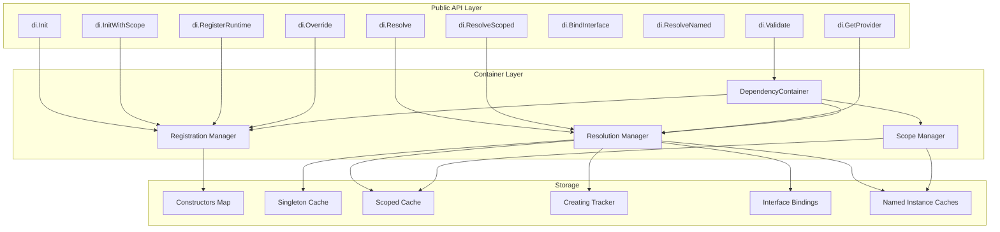

## Core Components

### 1. DependencyContainer

Central component that manages all dependencies.

**Key Fields:**
- `constructors`: Map of type → Registration (constructor + scope)
- `dependencies`: Singleton instance cache
- `scopedInstances`: Scoped instance cache (by scope ID)
- `creating`: Circular dependency detection tracker
- `resolutionStack`: Dependency chain for error reporting
- `interfaceBindings`: Unnamed interface → concrete type mapping
- `namedInterfaceBindings`: Named interface bindings (name → interface → type)
- `namedConstructors`: Named concrete type constructors
- `namedDependencies`: Named singleton instance cache
- `namedScopedInstances`: Named scoped instance cache

**Thread Safety:**
- Uses `sync.RWMutex` for concurrent access
- Read locks for cache lookups
- Write locks for instance creation

### 2. Registration

Holds constructor metadata.

```go
type Registration struct {
    constructor func(*DependencyContainer, string) (interface{}, error)
    scope       Scope
    paramTypes  []reflect.Type // Metadata for validation
}
```

### 3. Scope Types

```go
const (
    Singleton Scope = iota  // Created once, cached globally
    Transient              // Created every time
    Scoped                 // Created once per scope context
)
```

## Resolution Flow

### Singleton Resolution

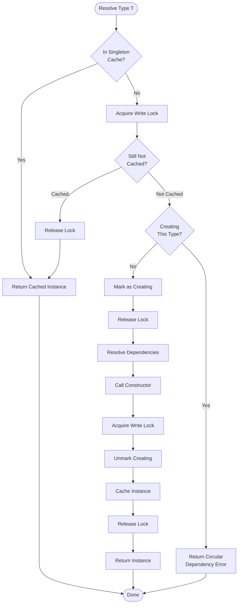

### Transient Resolution

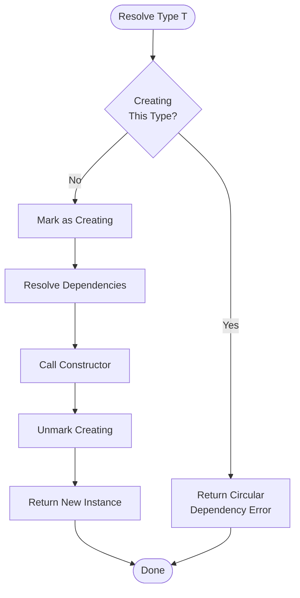

### Scoped Resolution

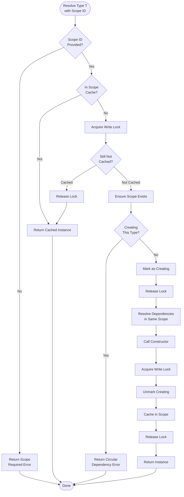

### Interface-Based Resolution

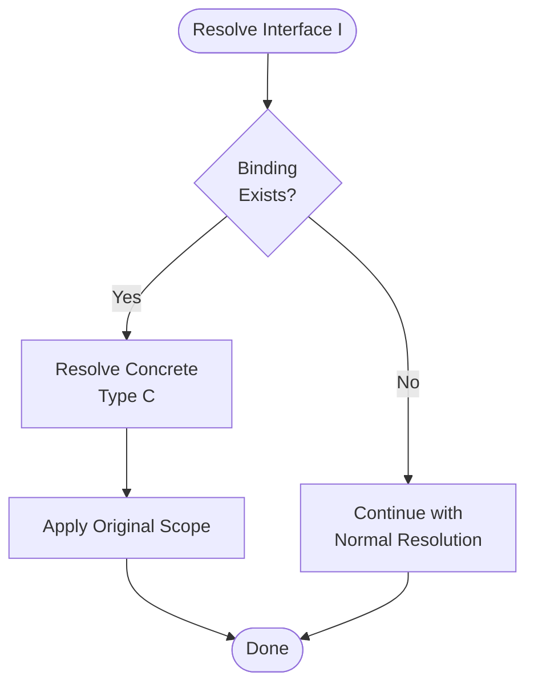

### Eager Graph Validation

DepWeaver employs a **Validation on Mutation** strategy. Every function that modifies the dependency graph—including `Init`, `RegisterRuntime`, `Override`, and `BindInterface`—automatically triggers a full graph validation. This ensures that the container never enters an invalid state (cycles or missing dependencies).

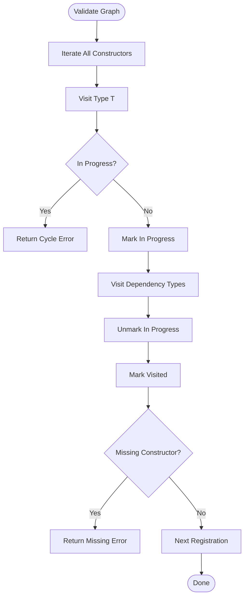

### Test Overrides

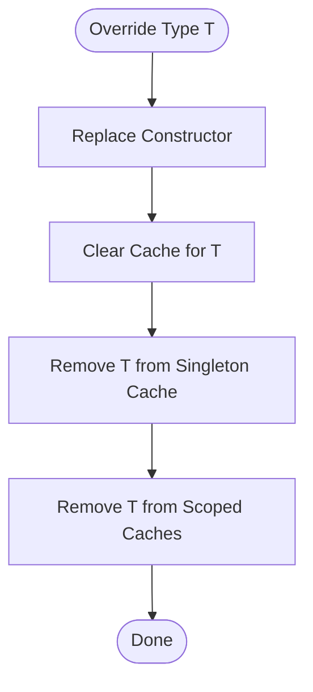

## Provider Pattern

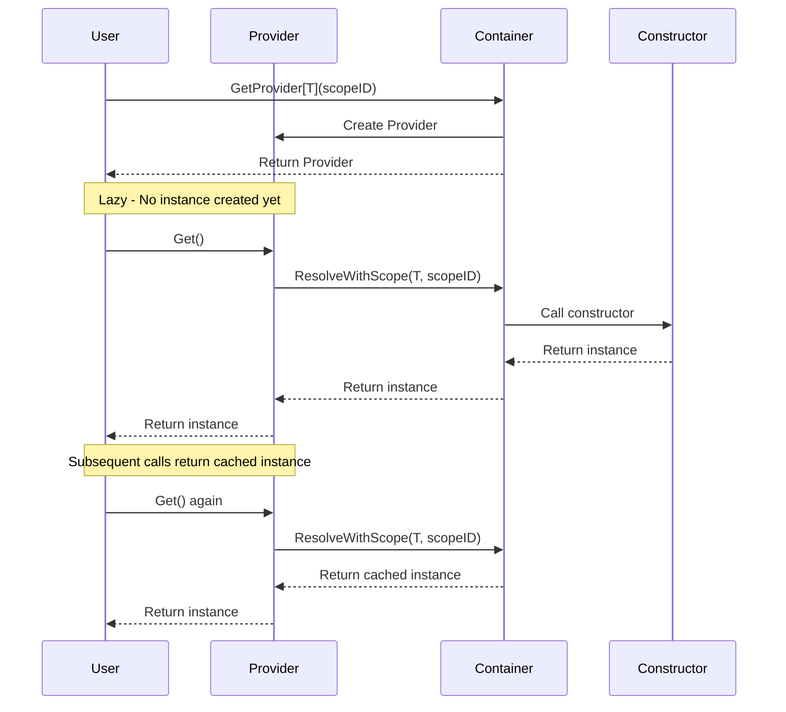

## Scope Lifecycle

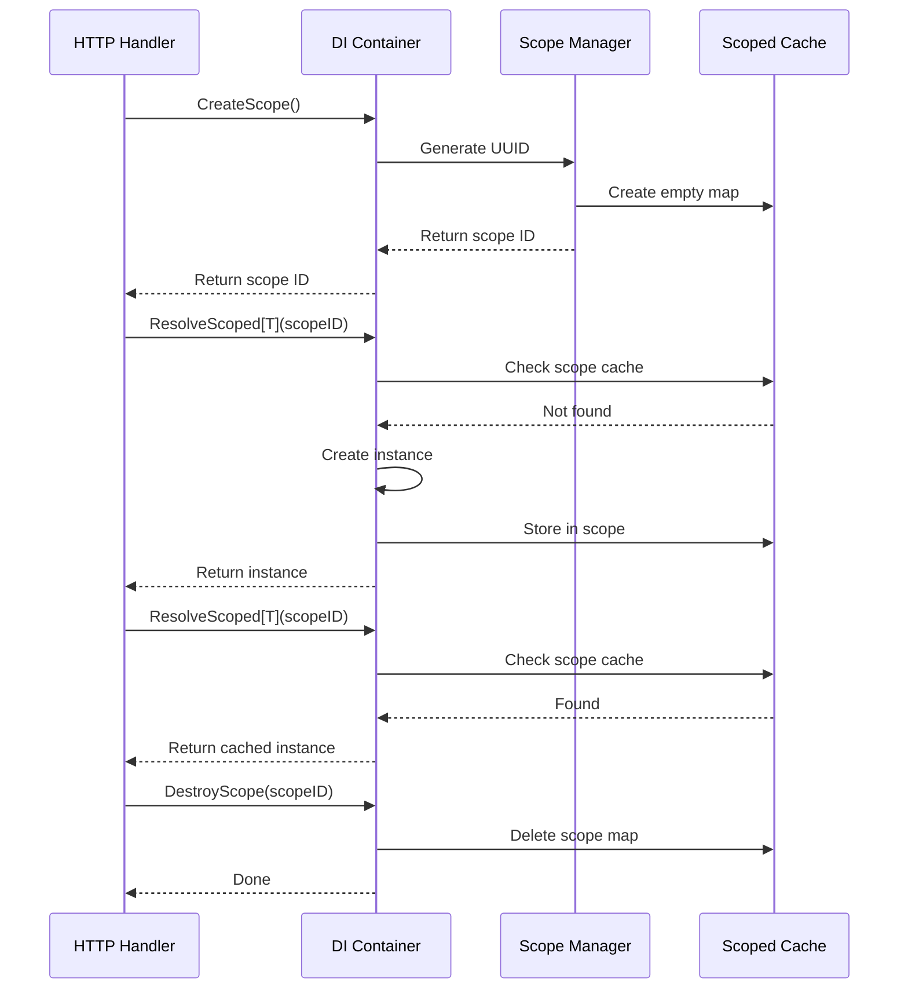

## Circular Dependency Detection

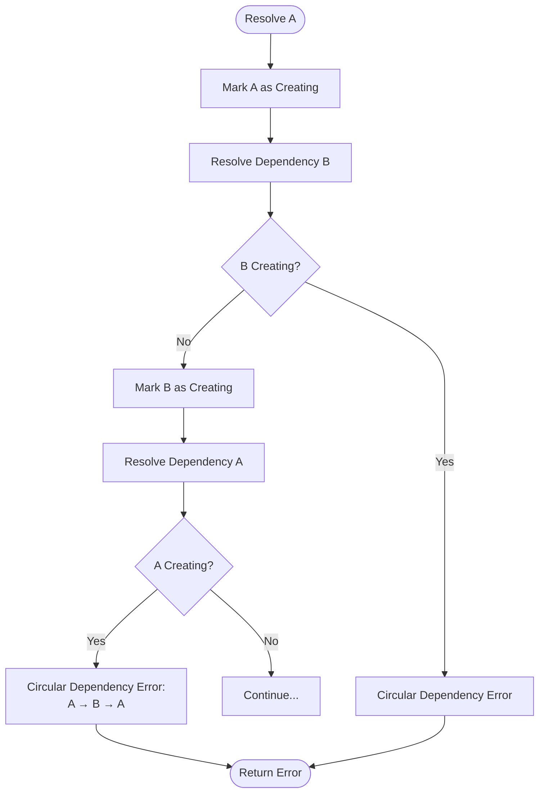

## Thread Safety Strategy

### Read-Write Lock Pattern

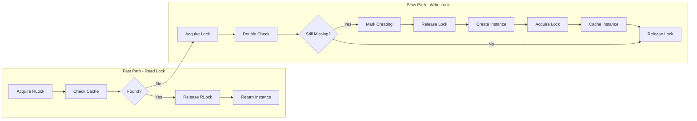

### Concurrent Resolution

Multiple goroutines can:
- ✅ Read cached singletons concurrently (RLock)
- ✅ Create different types concurrently (separate locks per type)
- ✅ Resolve transients concurrently (no caching)
- ✅ Use different scopes concurrently (separate scope caches)

Only one goroutine creates a singleton instance (double-checked locking).

## Performance Characteristics

| Operation | First Call | Subsequent Calls | Concurrency |
|-----------|-----------|------------------|-------------|
| Singleton | Slow (construction + lock) | Fast (read lock) | High |
| Transient | Slow (construction) | Slow (construction) | Very High |
| Scoped | Slow (construction + lock) | Fast (read lock) | High (per scope) |
| Provider.Get() | Deferred to Get() | Same as scope | Same as scope |

## Memory Management

### Singleton Cache
- Lives for application lifetime
- Cleared only on `Reset()`

### Scoped Cache
- Lives for scope lifetime
- Cleared on `DestroyScope(scopeID)`
- Important: Always call `DestroyScope()` to prevent memory leaks

### Transient
- No caching
- Garbage collected when no references remain

## Error Handling

### Error Types

1. **No Constructor Registered**
   ```
   no constructor registered for type *MyType
   ```

2. **Circular Dependency**
   ```
   circular dependency detected: *ServiceA → *ServiceB → *ServiceA
   ```

3. **Scope Required**
   ```
   scope ID required for scoped dependency *RequestContext
   ```

4. **Constructor Error**
   ```
   error resolving dependency for *MyType: <original error>
   ```

All errors are propagated up the dependency chain with context.
